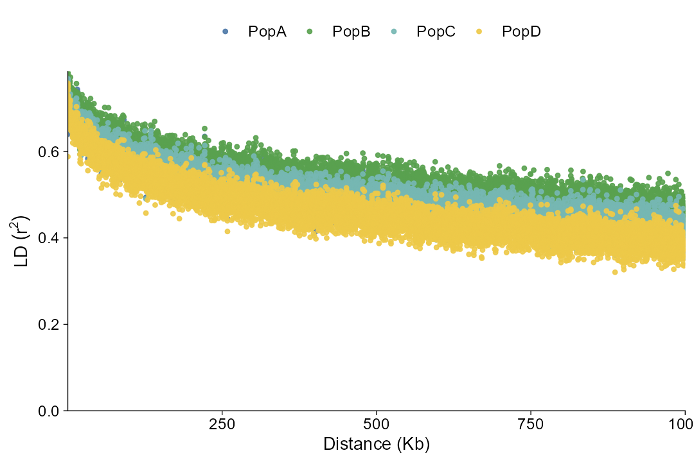
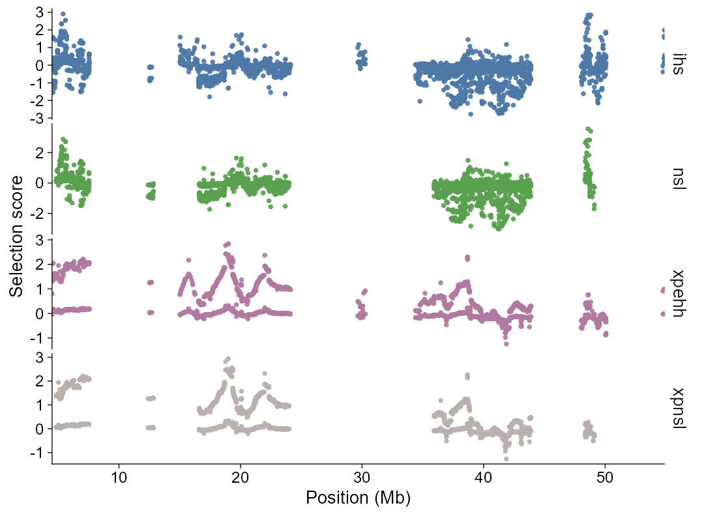
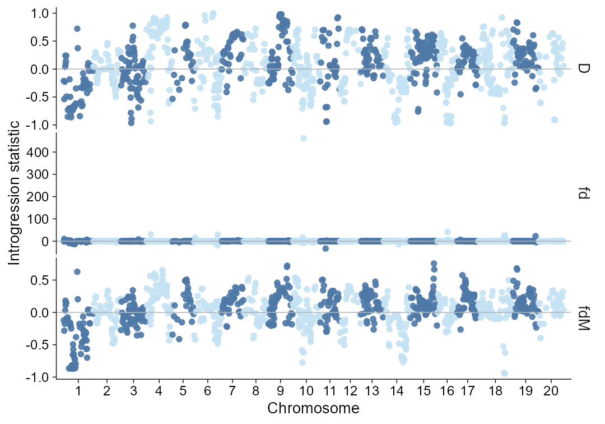
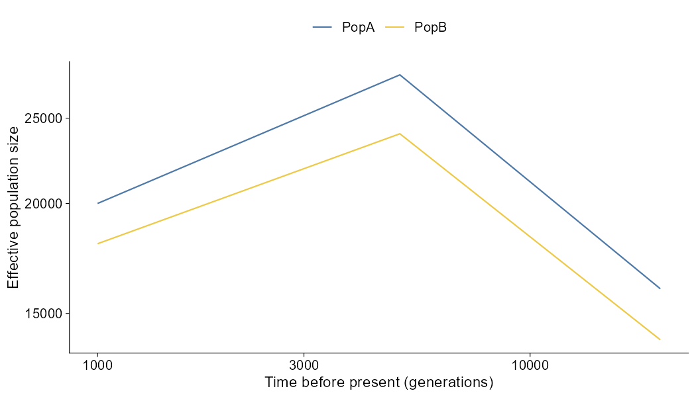

<!-- README.md is maintained directly for now. -->

# ggPopi <a href="https://wwz33.github.io/ggPopi/"></a>

<!-- badges: start -->

[](https://www.r-project.org/)
[](https://ggplot2.tidyverse.org/)
[](https://wwz33.github.io/ggPopi/)
<!-- badges: end -->

The goal of `ggPopi` is to streamline publication-ready population-genomics
visualization in R. It combines typed import helpers, direct plotting functions,
and composable `ggplot2` extension layers for GWAS, PCA, and admixture results.
It also includes a population genomics statistics module for windowed FST, pi,
Tajima's D, Dxy, and Watterson's theta summaries, LD decay curves, plus
selective sweep scan plots for selscan and XPCLR outputs, and introgression
summaries from Dsuite local and trio statistics, ADMIXTOOLS f-stat tables, and
TreeMix lightweight graph summaries. It also includes effective population size history
curves from PSMC, MSMC2, SMC++, and Stairway Plot 2 outputs.

`ggPopi` focuses on a tidy workflow:

``` r
import_gwas("assoc.mlma", type = "gcta") |>
  plot_manha()

import_gwas("assoc.mlma", type = "gcta") |>
  ggpop() +
  geom_manha()
```

Both paths return `ggplot` objects. The direct `plot_*()` functions define the
publication-style visual contract, and the matching `geom_*()` layers follow the
same defaults inside a `ggpop()` pipeline.

The package name is `ggPopi`; the core layered constructor remains `ggpop()` for
API continuity.

GWAS Manhattan plots support explicit palette control:

``` r
plot_manha(gwas, palette = "publication")
plot_manha(gwas, palette = c("#4E79A7", "#C4E2F3"), binary = TRUE)
plot_manha(gwas, threshold_color = "#D55E00", suggestive_color = "grey70")
```

Manhattan-like genome views use the same alternating `#4E79A7` / `#C4E2F3`
chromosome palette by default.

## Installation

You can install the development version from [GitHub](https://github.com/) with:

``` r
# install.packages("pak")
pak::pak("WWz33/ggPopi")
```

The core package uses CRAN-available dependencies for native plotting. The GWAS
module includes internal fastman-style Manhattan and Q-Q plotting logic, so
ordinary GWAS plots do not require installing `fastman`.

- [`flashpcaR`](https://github.com/WWz33/flashpca/tree/master/flashpcaR) for `compute_pca(method = "flashpca")`;
- [`pophelper`](https://github.com/royfrancis/pophelper) for direct `plotQ()` compatibility helpers.

Dependency repository policy:

- `pophelper` is unmodified and points to the original upstream repository.
- `flashpcaR` required Windows source-install fixes and points to
  <https://github.com/WWz33/flashpca>.

## Usage

Here are the main workflows.

Also have a look at the [getting started
guide](https://wwz33.github.io/ggPopi/articles/ggPopi.html) and the [full
documentation](https://wwz33.github.io/ggPopi/reference/).

``` r
library(ggPopi)

import_gwas("assoc.mlma", type = "gcta") |>
  plot_manha()
```

<p align="center"></p>

``` r
import_gwas("assoc.mlma", type = "gcta") |>
  ggpop() +
  geom_manha()
```

``` r
import_pca(
  "plink.eigenvec",
  type = "plink",
  pop_group = "pop_group.txt"
) |>
  plot_pca()
```

<p align="center"></p>

`pop_group` is optional at plot time:

``` r
plot_pca(pca, pop_group = FALSE)
```

``` r
import_admix(
  "admixture_results/",
  type = "admixture",
  ind = "samples.fam",
  pop_group = "pop_group.txt"
) |>
  plot_admix(k = 3, sort = "all", order_group = TRUE)
```

<p align="center"></p>

`pop_group` is optional at plot time:

``` r
plot_admix(admix, k = 3, pop_group = FALSE)
```

``` r
import_admix(
  "admixture_results/",
  type = "admixture",
  ind = "samples.fam",
  pop_group = "pop_group.txt"
) |>
  ggpop() +
  geom_admix(k = 3, sort = "all", order_group = TRUE)
```

Population groups use a simple two-column `sample pop` file:

``` text
sample  pop
P001    PopA
P002    PopB
```

``` r
import_stats("pixy_results/", type = "pixy") |>
  plot_stats(stat = "all", chr = "chr2L")
```

<p align="center"></p>

``` r
import_stats("vcftools_results/", type = "vcftools") |>
  plot_stats(stat = "all", chr = "chr2L")
```

``` r
ld_decay <- import_ld_decay(
  "PopLDdecay_results/",
  type = "poplddecay",
  pop_group = "pop_group.txt"
)

plot_ld_decay(ld_decay, style = "point")
plot_ld_decay(ld_decay, style = "line")
plot_ld_decay(ld_decay, style = "fit")
```

<p align="center"></p>

``` r
selscan_chr1 <- import_selection(
  "selscan_results/",
  ihs = "chr1.ihs.out.100bins.norm",
  nsl = "chr1.nsl.out.100bins.norm",
  xpehh = "chr1.xpehh.out.norm",
  xpnsl = "chr1.xpnsl.out.norm",
  type = "selscan"
)

plot_selection(
  selscan_chr1,
  stat = c("ihs", "nsl", "xpehh", "xpnsl"),
  chr = "1"
)
```

<p align="center"></p>

Selection plots support signed or absolute score views. Fixed thresholds such
as `threshold = 2` draw score cutoffs directly, while
`threshold = 0.95, threshold_type = "quantile"` derives a cutoff from the
filtered scan values. Genome-wide calls default to a Manhattan-like chromosome
axis; calls with `chr`, `start`, or `end` default to a single-region view.

``` r
intro <- import_introgression(
  "introgression/Dsuite/PopB_PopC_PopA_localFstats_run1_100_50.txt",
  type = "dsuite_dinvestigate"
)

plot_introgression(intro, stat = c("D", "fd", "fdM"))
```

<p align="center"></p>

The bundled Dsuite localFstats table is a compact window scan for examples and
tests. The trio/statistic examples use a small highland/lowland/hybrid toy
system so non-window plots have meaningful positive, negative, and near-zero
signals. The same importer also reads Dsuite BBAA/Dmin trio summaries,
ADMIXTOOLS qpdstat/f3/f4ratio tables, and TreeMix internal edge/treeout
summaries. For TreeMix `*.edges.gz`, a matching `*.vertices.gz` file is used
when present to preserve the drift-coordinate layout.

Dsuite trio-level D-statistics default to a P2-by-P3 matrix, which is the more
useful publication view for BBAA/Dmin-style summaries. The same table can still
be shown as an ordered forest/lollipop summary with `style = "trio"`:

``` r
import_introgression("introgression/Dsuite/dsuite_results_BBAA.txt", type = "dsuite_dtrios") |>
  plot_introgression()

import_introgression("introgression/Dsuite/dsuite_results_BBAA.txt", type = "dsuite_dtrios") |>
  plot_introgression(style = "trio")
```

``` r
ne_history <- import_demographic_history(
  system.file("extdata", "ne_history", "SMC++", "model.csv", package = "ggPopi"),
  type = "smcpp",
  mutation_rate = 1.2e-8,
  generation_time = 5
)

plot_demographic_history(ne_history)
```

<p align="center"></p>

Ne history plots read output from PSMC, MSMC2, SMC++, or Stairway Plot 2.
`import_demographic_history()`, `plot_demographic_history()`, and
`geom_demographic_history()` are aliases for users who think in demographic
history terms. The bundled SMC++ CSV is an Acropora-style output-shaped example
using the package `pop_group.txt` population labels (`PopA`-`PopD`) and
biologically plausible bottleneck/recovery histories; raw VCF and `pop_group`
metadata are upstream inputs to the external inference tools, not direct Ne
history curves inferred inside `ggPopi`.

## Interface

The recommended user-facing API is intentionally small.

| Module | Import | Direct plot | ggplot extension |
|---|---|---|---|
| GWAS Manhattan | `import_gwas()` | `plot_manha()` | `ggpop() + geom_manha()` |
| GWAS Q-Q | `import_gwas()` | `plot_qq()` | `ggpop() + geom_qq()` |
| PCA | `import_pca()` / `compute_pca()` | `plot_pca()` | `ggpop() + geom_pca()` |
| Admixture | `import_admix()` | `plot_admix()` | `ggpop() + geom_admix()` |
| Population statistics | `import_stats()` | `plot_stats()` | `ggpop() + geom_stats()` |
| LD decay | `import_ld_decay(method = ...)` | `plot_ld_decay(measure = ...)` | `ggpop() + geom_ld_decay(measure = ...)` |
| Selective sweeps | `import_selection()` | `plot_selection()` | `ggpop() + geom_selection()` |
| Introgression | `import_introgression()` | `plot_introgression()` | `ggpop() + geom_introgression()` |
| Demographic / Ne history | `import_ne_history()` / `import_demographic_history()` | `plot_ne_history()` / `plot_demographic_history()` | `ggpop() + geom_ne_history()` / `geom_demographic_history()` |
| Population groups | `import_pop_group()` | used by plot functions | used by geom layers |

Advanced compatibility helpers remain available for users who need direct
backend behavior, but ordinary workflows should prefer the `import_*() |>
plot_*()` and `import_*() |> ggpop() + geom_*()` interfaces.

## Color Schemes

`ggpop` provides a unified discrete palette entry for population-genomics
categorical variables. PCA population colours and admixture cluster fills use the
same publication-oriented palette system by default.

``` r
ggpop_palette(5, "population")
ggpop_palette(5, "admixture")
scale_colour_ggpop("population")
scale_fill_ggpop("admixture")
```

## Fixed Installation Issues

This version includes dependency fixes needed for reliable source installation:

- replaced `flashpcaR/flashpcaR/src/*.cpp` and `src/*.h` path stubs with real source files;
- changed `flashpcaR/flashpcaR/src/Makevars` and `Makevars.win` from `CXX11` to `CXX14`;
- embedded fastman-style Manhattan and Q-Q plotting behavior in native ggplot layers.

## Documentation

- [GWAS guide](https://wwz33.github.io/ggPopi/articles/guides/gwas.html)
  Manhattan and Q-Q plotting workflows
- [PCA guide](https://wwz33.github.io/ggPopi/articles/guides/pca.html)
  PCA imports, population colours, and plotting
- [Admixture guide](https://wwz33.github.io/ggPopi/articles/guides/admixture.html)
  ADMIXTURE/STRUCTURE imports, group labels, and sorting
- [Population statistics guide](https://wwz33.github.io/ggPopi/articles/guides/stats.html)
  Windowed FST, pi, Tajima's D, Dxy, and Watterson's theta plotting
- [LD decay guide](https://wwz33.github.io/ggPopi/articles/guides/ld-decay.html)
  PopLDdecay imports with point and line plot styles
- [Selective sweep guide](https://wwz33.github.io/ggPopi/articles/guides/selection.html)
  selscan and XPCLR imports, signed or absolute score plots, and quantile thresholds
- [Introgression guide](https://wwz33.github.io/ggPopi/articles/guides/introgression.html)
  Dsuite local/trio statistics, ADMIXTOOLS f-stat summaries, and TreeMix graph summaries
- [Ne history guide](https://wwz33.github.io/ggPopi/articles/guides/ne-history.html)
  PSMC, MSMC2, SMC++, and Stairway Plot 2 effective population size histories

## Acknowledgements

`ggpop` builds on `ggplot2` and follows tidy plotting conventions inspired by
packages such as `tidyplots`. Optional compatibility paths reference
`flashpcaR` and `pophelper`, while GWAS Manhattan and Q-Q plots use native
ggplot layers with `fastman`-style data transformation and layout.
