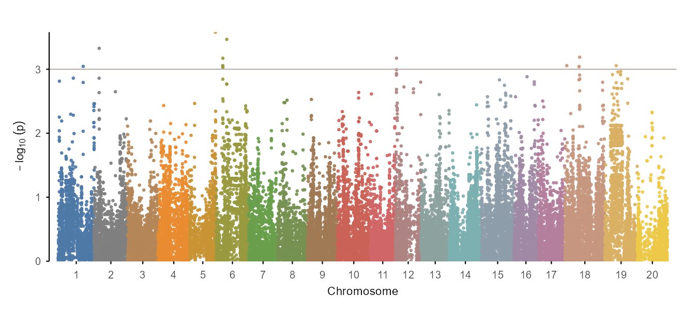
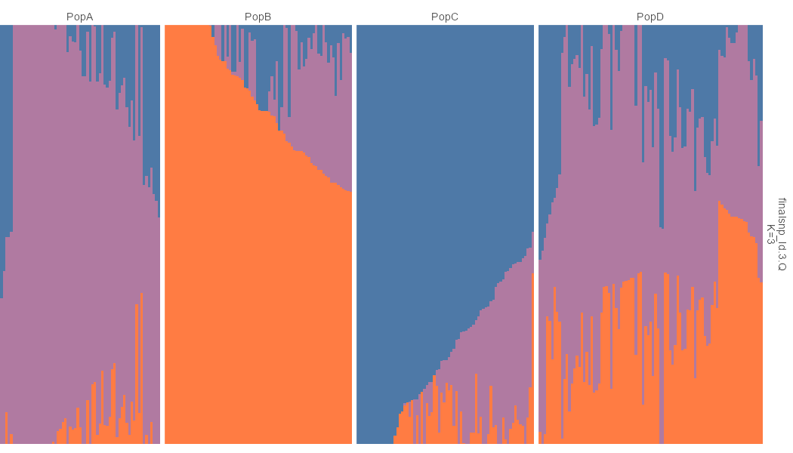

<!-- README.md is maintained directly for now. -->

# ggpop <a href="https://wwz33.github.io/ggpop/"></a>

<!-- badges: start -->

[](https://www.r-project.org/)
[](https://ggplot2.tidyverse.org/)
[](https://wwz33.github.io/ggpop/)
<!-- badges: end -->

The goal of `ggpop` is to streamline publication-ready population-genomics
visualization in R. It combines typed import helpers, direct plotting functions,
and composable `ggplot2` extension layers for GWAS, PCA, and admixture results.
It also includes a population genomics statistics module for windowed FST, pi,
Tajima's D, Dxy, and Watterson's theta summaries.

`ggpop` focuses on a tidy workflow:

``` r
import_gwas("assoc.mlma", type = "gcta") |>
  plot_manha()

import_gwas("assoc.mlma", type = "gcta") |>
  ggpop() +
  geom_manha()
```

Both paths return `ggplot` objects. The direct `plot_*()` functions define the
publication-style visual contract, and the matching `geom_*()` layers follow the
same defaults inside a `ggpop()` pipeline.

GWAS Manhattan plots support explicit palette control:

``` r
plot_manha(gwas, palette = "publication")
plot_manha(gwas, palette = c("#123456", "#654321"), binary = TRUE)
```

## Installation

You can install the development version from [GitHub](https://github.com/) with:

``` r
# install.packages("pak")
pak::pak("WWz33/ggpop")
```

The core package uses CRAN-available dependencies for native plotting. The GWAS
module includes internal fastman-style Manhattan and Q-Q plotting logic, so
ordinary GWAS plots do not require installing `fastman`.

- [`flashpcaR`](https://github.com/WWz33/flashpca/tree/master/flashpcaR) for `compute_pca(method = "flashpca")`;
- [`pophelper`](https://github.com/royfrancis/pophelper) for direct `plotQ()` compatibility helpers.

Dependency repository policy:

- `pophelper` is unmodified and points to the original upstream repository.
- `flashpcaR` required Windows source-install fixes and points to
  <https://github.com/WWz33/flashpca>.

## Usage

Here are the main workflows.

Also have a look at the [getting started
guide](https://wwz33.github.io/ggpop/articles/ggpop.html) and the [full
documentation](https://wwz33.github.io/ggpop/reference/).

``` r
library(ggpop)

import_gwas("assoc.mlma", type = "gcta") |>
  plot_manha(title = "GCTA Manhattan")
```



``` r
import_gwas("assoc.mlma", type = "gcta") |>
  ggpop() +
  geom_manha()
```

``` r
import_pca(
  "plink.eigenvec",
  type = "plink",
  pop_group = "pop_group.txt"
) |>
  plot_pca(title = "PCA by population")
```


`pop_group` is optional at plot time:

``` r
plot_pca(pca, pop_group = FALSE)
```

``` r
import_admix(
  "admixture_results/",
  type = "admixture",
  ind = "samples.fam",
  pop_group = "pop_group.txt"
) |>
  plot_admix(k = 3, sort = "all", order_group = TRUE)
```



`pop_group` is optional at plot time:

``` r
plot_admix(admix, k = 3, pop_group = FALSE)
```

``` r
import_admix(
  "admixture_results/",
  type = "admixture",
  ind = "samples.fam",
  pop_group = "pop_group.txt"
) |>
  ggpop() +
  geom_admix(k = 3, sort = "all", order_group = TRUE)
```

Population groups use a simple two-column `sample pop` file:

``` text
sample  pop
P001    PopA
P002    PopB
```

``` r
import_stats("pixy_results/", type = "pixy") |>
  plot_stats(stat = c("fst", "pi"), chr = "chr2L")
```

## Interface

The recommended user-facing API is intentionally small.

| Module | Import | Direct plot | ggplot extension |
|---|---|---|---|
| GWAS Manhattan | `import_gwas()` | `plot_manha()` | `ggpop() + geom_manha()` |
| GWAS Q-Q | `import_gwas()` | `plot_qq()` | `ggpop() + geom_qq()` |
| PCA | `import_pca()` / `compute_pca()` | `plot_pca()` | `ggpop() + geom_pca()` |
| Admixture | `import_admix()` | `plot_admix()` | `ggpop() + geom_admix()` |
| Population statistics | `import_stats()` | `plot_stats()` | `ggpop() + geom_stats()` |
| Population groups | `import_pop_group()` | used by plot functions | used by geom layers |

Advanced compatibility helpers remain available for users who need direct
backend behavior, but ordinary workflows should prefer the `import_*() |>
plot_*()` and `import_*() |> ggpop() + geom_*()` interfaces.

## Color Schemes

`ggpop` provides a unified discrete palette entry for population-genomics
categorical variables. PCA population colours and admixture cluster fills use the
same publication-oriented palette system by default.

``` r
ggpop_palette(5, "population")
ggpop_palette(5, "admixture")
scale_colour_ggpop("population")
scale_fill_ggpop("admixture")
```

## Fixed Installation Issues

This version includes dependency fixes needed for reliable source installation:

- replaced `flashpcaR/flashpcaR/src/*.cpp` and `src/*.h` path stubs with real source files;
- changed `flashpcaR/flashpcaR/src/Makevars` and `Makevars.win` from `CXX11` to `CXX14`;
- embedded fastman-style Manhattan and Q-Q plotting behavior in native ggplot layers.

## Documentation

- [GWAS guide](https://wwz33.github.io/ggpop/articles/guides/gwas.html)
  Manhattan and Q-Q plotting workflows
- [PCA guide](https://wwz33.github.io/ggpop/articles/guides/pca.html)
  PCA imports, population colours, and plotting
- [Admixture guide](https://wwz33.github.io/ggpop/articles/guides/admixture.html)
  ADMIXTURE/STRUCTURE imports, group labels, and sorting
- [Population statistics guide](https://wwz33.github.io/ggpop/articles/guides/stats.html)
  Windowed FST, pi, Tajima's D, Dxy, and Watterson's theta plotting

## Acknowledgements

`ggpop` builds on `ggplot2` and follows tidy plotting conventions inspired by
packages such as `tidyplots`. Optional compatibility paths reference
`flashpcaR` and `pophelper`, while GWAS Manhattan and Q-Q plots use native
ggplot layers with fastman-style data transformation and layout.
