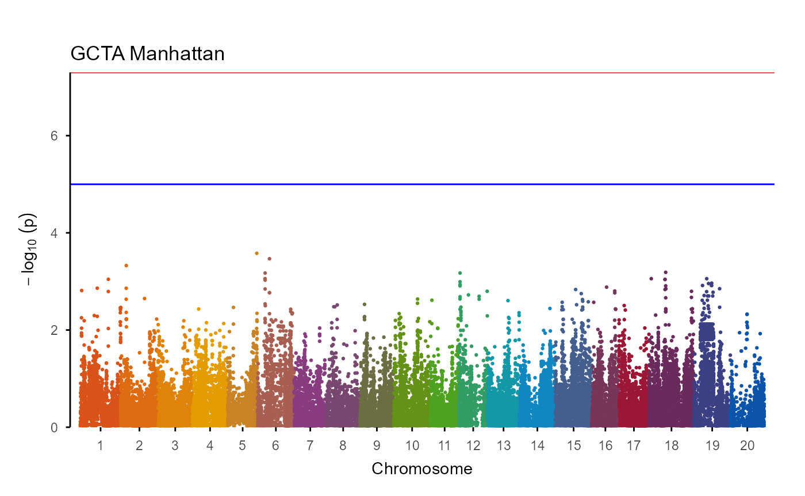
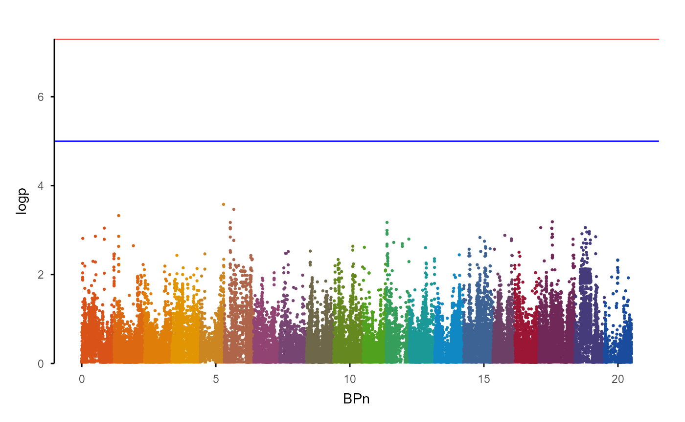
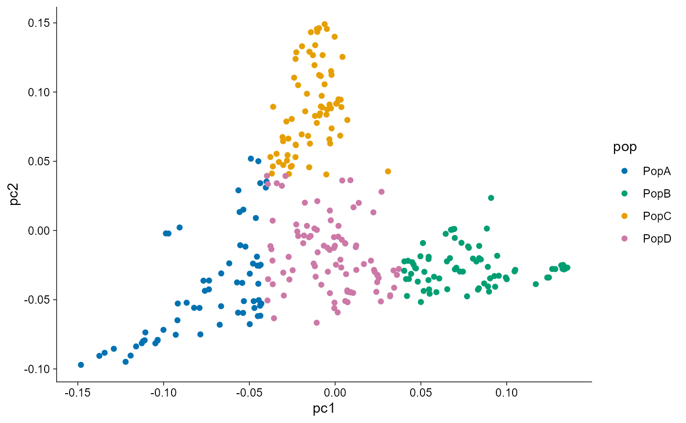
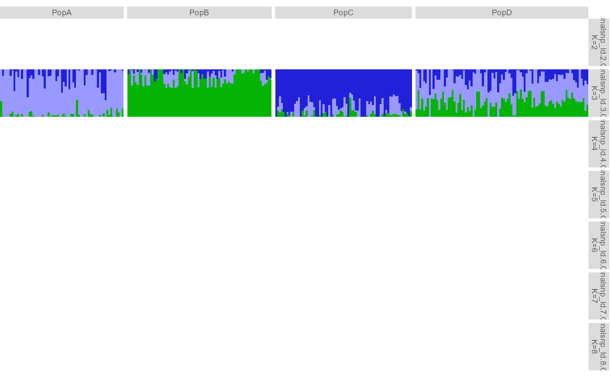
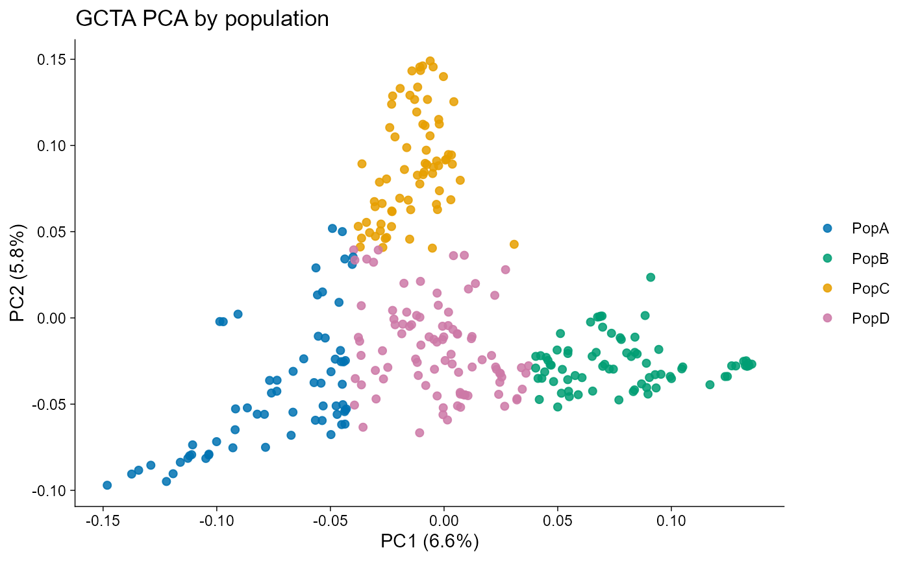
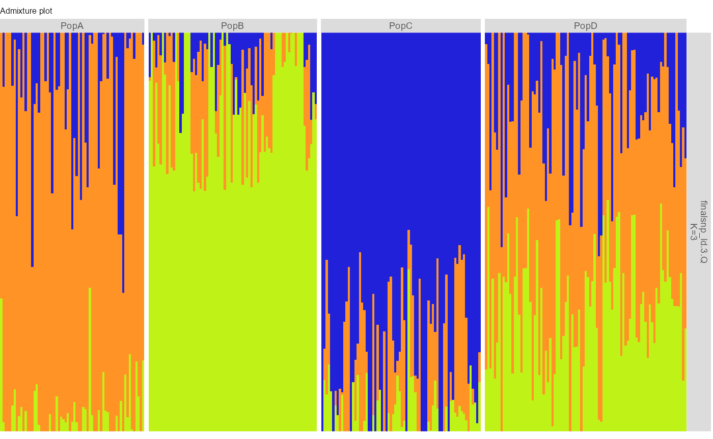

# Getting Started with ggpop

`ggpop` is a ggplot2 extension package for population genetics
workflows. The package keeps each module in the same tidy shape:

- `import_*()` functions create typed S3 objects.
- `plot_*()` functions return full `ggplot` objects.
- [`ggpop()`](https://ggpop.local/reference/ggpop.md) + `geom_*()` build
  layered ggplot extensions.
- Advanced compatibility helpers remain exported for users who need
  original-package behavior.

## Module API map

| Module | Import | Direct plot | ggplot extension path | Advanced / compatibility |
|----|----|----|----|----|
| GWAS Manhattan | [`import_gwas()`](https://ggpop.local/reference/import_gwas.md) | [`plot_manha()`](https://ggpop.local/reference/plot_manha.md) | `ggpop() + geom_manha()` | `fastman` backend when installed |
| GWAS Q-Q | [`import_gwas()`](https://ggpop.local/reference/import_gwas.md) | [`plot_qq()`](https://ggpop.local/reference/plot_qq.md) | `ggpop() + ggpop::geom_qq()` | `fastman` backend when installed |
| PCA | [`import_pca()`](https://ggpop.local/reference/import_pca.md) / [`compute_pca()`](https://ggpop.local/reference/import_pca.md) | [`plot_pca()`](https://ggpop.local/reference/plot_pca.md) | `ggpop() + geom_pca()` | `compute_pca(method = "flashpca")` |
| Admixture | [`import_admix()`](https://ggpop.local/reference/import_admixture.md) / [`import_admixture()`](https://ggpop.local/reference/import_admixture.md) | [`plot_admix()`](https://ggpop.local/reference/plot_admix.md) | `ggpop() + geom_admix()` | [`plot_pophelper_q()`](https://ggpop.local/reference/pophelper_compat.md) / [`plot_admixture_pophelper()`](https://ggpop.local/reference/plot_admix.md) |

## Core pattern

``` r
gwas <- import_gwas(ggpop_extdata("gwas", "gcta.mlma"), type = "gcta")
pca <- import_pca(
  ggpop_extdata("pca", "gcta.eigenvec"),
  type = "gcta",
  eigenval = ggpop_extdata("pca", "gcta.eigenval"),
  pop_group = ggpop_extdata("pop_group.txt")
)
admix <- import_admix(
  ggpop_extdata("admixture"),
  type = "admixture",
  ind = ggpop_extdata("snp", "finalsnp_ld.fam"),
  pop_group = ggpop_extdata("pop_group.txt")
)
```

Each importer returns a typed object:

``` r
class(gwas)
#> [1] "ggpop_gwas" "data.frame"
class(pca)
#> [1] "ggpop_pca"  "data.frame"
class(admix)
#> [1] "ggpop_admix" "data.frame"
```

## Tidy plotting style

Every module has two user-facing plotting paths. Use the direct
`plot_*()` function when you want the reference plot immediately, or use
[`ggpop()`](https://ggpop.local/reference/ggpop.md) plus the module
`geom_*()` when you want to compose with other ggplot layers.

The direct path:

``` r
gwas |>
  plot_manha(title = "GCTA Manhattan", use_fastman = FALSE)
```



The ggplot extension path:

``` r
gwas |>
  ggpop() +
  geom_manha()
```



The same pattern applies across modules:

``` r
gwas |> ggpop() + ggpop::geom_qq()
```


``` r
pca |> ggpop() + geom_pca()
```



``` r
admix |> ggpop() + geom_admix(k = 3, order_group = TRUE)
```



## Population groups and discrete colours

Population grouping uses a simple two-column file:

``` r
head(import_pop_group(ggpop_extdata("pop_group.txt")))
#>   sample_id  pop
#> 1      P001 PopC
#> 2      P004 PopB
#> 3      P006 PopC
#> 4      P009 PopA
#> 5      P010 PopB
#> 6      P012 PopB
```

The same file drives PCA colours and admixture group labels:

``` r
pca |> plot_pca(title = "GCTA PCA by population")
```



``` r
admix |> plot_admix(k = 3, order_group = TRUE, show_group_labels = TRUE)
```



All categorical colours use a unified discrete palette entry:

``` r
ggpop_palette(4, "population")
#> [1] "#0072B2" "#009E73" "#E69F00" "#CC79A7"
ggpop_palette(8, "admixture")
#> [1] "#2121D9" "#9999FF" "#04B404" "#FFFB23" "#A945FF" "#0089B2" "#610B5E"
#> [8] "#BFF217"
```

## What to use

- Use [`plot_manha()`](https://ggpop.local/reference/plot_manha.md) and
  `ggpop() + geom_manha()` for Manhattan plots.
- Use [`plot_qq()`](https://ggpop.local/reference/plot_qq.md) and
  `ggpop() + ggpop::geom_qq()` for Q-Q plots.
- Use [`plot_pca()`](https://ggpop.local/reference/plot_pca.md) and
  `ggpop() + geom_pca()` for PCA plots.
- Use [`plot_admix()`](https://ggpop.local/reference/plot_admix.md) and
  `ggpop() + geom_admix()` for admixture plots.
- Treat the direct `plot_*()` functions as the reference style;
  `geom_*()` is the same look inside a ggplot composition.
- Use
  [`plot_pophelper_q()`](https://ggpop.local/reference/pophelper_compat.md)
  or
  [`plot_admixture_pophelper()`](https://ggpop.local/reference/plot_admix.md)
  only when you need compatibility with existing `pophelper` workflows.
