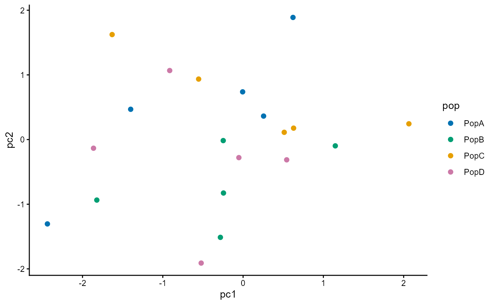

# Discrete color schemes

`ggpop` focuses on population-genomics categorical variables, so the
palette API is discrete-only. It follows the tidyplots color-scheme
idea: pass a named scheme or hex vector, downsample extra colours, and
interpolate when more categories are requested.

## Built-in schemes

``` r
ggpop_palette(4, "population")
#> [1] "#0072B2" "#009E73" "#E69F00" "#CC79A7"
ggpop_palette(8, "admixture")
#> [1] "#2121D9" "#9999FF" "#04B404" "#FFFB23" "#A945FF" "#0089B2" "#610B5E"
#> [8] "#BFF217"
ggpop_palette(5, "manhattan")
#> [1] "#D95319" "#E4A100" "#5EA500" "#0095D4" "#0C53AA"
```

## ggplot scales

``` r
df <- data.frame(
  pop = rep(c("PopA", "PopB", "PopC", "PopD"), each = 5),
  pc1 = rnorm(20),
  pc2 = rnorm(20)
)

ggplot2::ggplot(df, ggplot2::aes(pc1, pc2, colour = pop)) +
  ggplot2::geom_point(size = 2) +
  scale_colour_ggpop("population") +
  ggplot2::theme_classic()
```



## Custom palettes

``` r
my_pop_colors <- new_pop_palette(
  c("#644296", "#F08533", "#3B78B0", "#D1352C"),
  name = "my population palette"
)

ggpop_palette(6, my_pop_colors)
#> [1] "#644296" "#B86A5A" "#CB824C" "#5F7A97" "#775D7B" "#D1352C"
```
