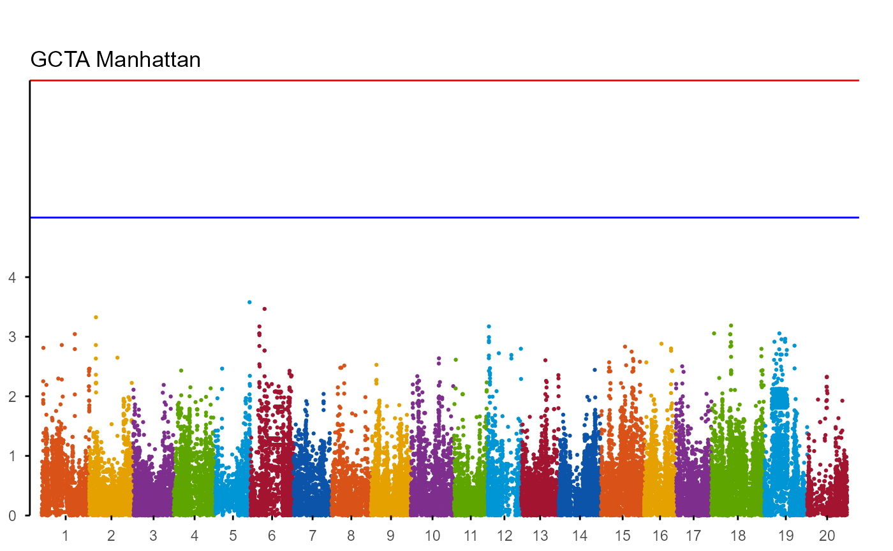
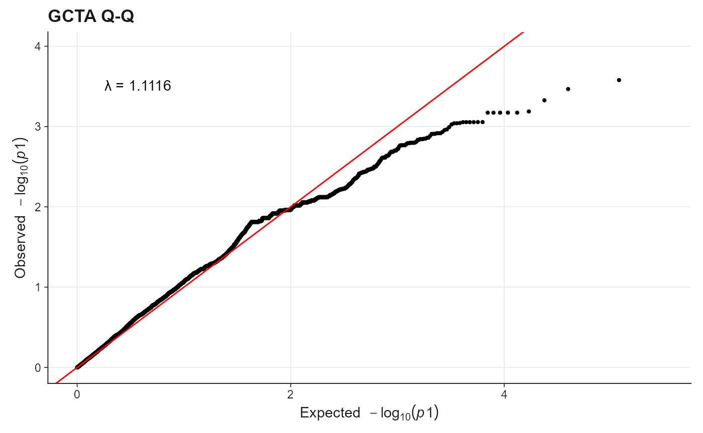
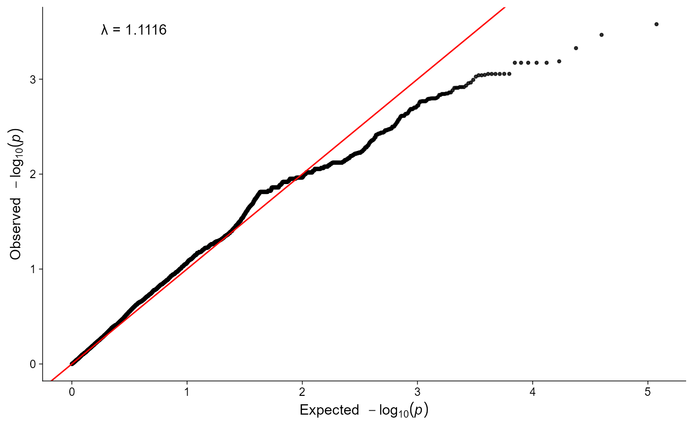

# GWAS plots

`ggpop` supports Manhattan and Q-Q plots from common GWAS outputs. The
intended flow is:

1.  import a typed object;
2.  plot with
    [`plot_manha()`](https://ggpop.local/reference/plot_manha.md) /
    [`plot_qq()`](https://ggpop.local/reference/plot_qq.md) or
    `ggpop() + geom_*()`;
3.  keep [`fastman`](https://github.com/adhikari-statgen-lab/fastman) as
    the optional fast path when installed.

## API summary

| Task | Direct API | Layer API | Notes |
|----|----|----|----|
| Import GCTA/GEMMA/EMMAX | `import_gwas(file, type = ...)` | \- | Returns `ggpop_gwas` |
| Manhattan | [`plot_manha()`](https://ggpop.local/reference/plot_manha.md) | `ggpop(data) + geom_manha()` | Defaults are aligned |
| Q-Q | [`plot_qq()`](https://ggpop.local/reference/plot_qq.md) | `ggpop(data) + ggpop::geom_qq()` | Use explicit namespace to avoid [`ggplot2::geom_qq()`](https://ggplot2.tidyverse.org/reference/geom_qq.html) |
| Backend | `use_fastman = TRUE` | native ggpop stat | Direct wrappers use fastman when available |

## GCTA example

``` r
gwas <- import_gwas(ggpop_extdata("gwas", "gcta.mlma"), type = "gcta")
```

``` r
plot_manha(gwas, title = "GCTA Manhattan", use_fastman = TRUE)
#> Loading required package: ggplot2
#> 
#> Attaching package: 'ggplot2'
#> The following object is masked from 'package:ggpop':
#> 
#>     geom_qq
#> Scale for y is already present.
#> Adding another scale for y, which will replace the existing scale.
```



``` r
plot_qq(gwas, title = "GCTA Q-Q", use_fastman = TRUE)
```



## Layered workflow

``` r
gwas |>
  ggpop() +
  geom_manha()
```


``` r

gwas |>
  ggpop() +
  ggpop::geom_qq()
```



`plot_manha(gwas, use_fastman = FALSE)` and `ggpop(gwas) + geom_manha()`
share the same default threshold and suggestive reference lines.

## Alternative GWAS formats

[`import_gwas()`](https://ggpop.local/reference/import_gwas.md) accepts
`type = "gcta"`, `type = "gemma"`, and `type = "emmax"`. The package
also keeps typo-compatible aliases for old prompts and notebooks. They
are compatibility helpers, not recommended in new code:

``` r
improt_gwas("assoc.mlma", type = "gcta")
prot_gwas("assoc.mlma", type = "gcta")
```

If `fastman` is installed, the direct GWAS wrappers use it by default.
If it is not installed, the ggplot-native path still works.
