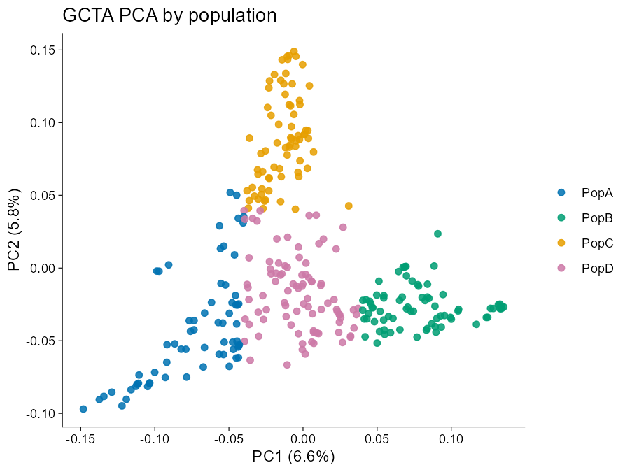

# ggpop

`ggpop` is a ggplot2 extension package for population-genetics plots.

## Modules

- [`import_gwas()`](https://ggpop.local/reference/import_gwas.md) +
  [`plot_manha()`](https://ggpop.local/reference/plot_manha.md) /
  [`plot_qq()`](https://ggpop.local/reference/plot_qq.md) or
  [`ggpop()`](https://ggpop.local/reference/ggpop.md) +
  [`geom_manha()`](https://ggpop.local/reference/geom_manha.md) /
  [`ggpop::geom_qq()`](https://ggpop.local/reference/geom_qq.md) for
  GCTA, GEMMA, and EMMAX GWAS results, following
  [`fastman`](https://github.com/adhikari-statgen-lab/fastman) behavior
  and keeping `fastman` as a suggested reference dependency.
- [`import_pca()`](https://ggpop.local/reference/import_pca.md) +
  [`ggpop()`](https://ggpop.local/reference/ggpop.md) +
  [`geom_pca()`](https://ggpop.local/reference/geom_pca.md) for
  PLINK/GCTA PCA files, plus `compute_pca(method = "flashpca")` via
  `flashpcaR`.
- [`import_admix()`](https://ggpop.local/reference/import_admixture.md)
  /
  [`import_admixture()`](https://ggpop.local/reference/import_admixture.md)
  for full multi-K ADMIXTURE `.Q` result sets and limited STRUCTURE-like
  numeric Q matrices.
- Admixture user plotting is intentionally narrow: use
  [`plot_admix()`](https://ggpop.local/reference/plot_admix.md) for the
  direct path, or `ggpop() + geom_admix()` for the ggplot extension
  path.
- Population groups use a shared `sample pop` file through
  [`import_pop_group()`](https://ggpop.local/reference/import_pop_group.md)
  / `pop_group = ...`; PCA maps `pop` to colour and admixture uses it
  for pophelper-style group labels and sorting.
- Discrete population-genomics colours use one palette entry:
  `ggpop_palette()`, `scale_colour_ggpop()`, and `scale_fill_ggpop()`.
- Publication-oriented wrappers:
  [`plot_manha()`](https://ggpop.local/reference/plot_manha.md),
  [`plot_qq()`](https://ggpop.local/reference/plot_qq.md),
  [`plot_pca()`](https://ggpop.local/reference/plot_pca.md),
  [`plot_admix()`](https://ggpop.local/reference/plot_admix.md),
  [`theme_ggpop_publication()`](https://ggpop.local/reference/theme_ggpop_publication.md),
  and `ggpop_palette()`.
- Original-package compatibility:
  [`plot_manha()`](https://ggpop.local/reference/plot_manha.md) /
  [`plot_qq()`](https://ggpop.local/reference/plot_qq.md) use
  `fastman::fastman_gg()` / `fastman::fastqq_gg()` by default when
  available;
  [`plot_admixture_pophelper()`](https://ggpop.local/reference/plot_admix.md)
  converts ggpop admixture data to a `pophelper` qlist and calls
  [`pophelper::plotQ()`](https://rdrr.io/pkg/pophelper/man/plotQ.html).
- Advanced compatibility: `*_pub` helpers and `pophelper_*()` wrappers
  are exported for package integration and original-package parity, but
  are not the recommended user-facing admixture plotting API.

## Examples

``` r
import_gwas("assoc.mlma", type = "gcta") |>
  ggpop() +
  geom_manha()
```


Example Manhattan plot

``` r
import_gwas("assoc.mlma", type = "gcta") |>
  ggpop() +
  geom_qq()

import_pca("plink.eigenvec", type = "plink", pop_group = "pop_group.txt") |>
  ggpop() +
  geom_pca()
```



Example PCA plot

``` r
import_admix("admixture_results/", type = "admixture",
  ind = "samples.fam", pop_group = "pop_group.txt") |>
  plot_admix(k = "all", order_group = TRUE)

import_admix("admixture_results/", type = "admixture") |>
  plot_admix(k = c(2, 4))

import_admixture("run.2.Q", type = "admixture") |>
  ggpop() +
  geom_admix(k = 2)

import_gwas("assoc.mlma", type = "gcta") |>
  plot_manha(title = "Trait Manhattan", use_fastman = TRUE)

import_admixture("run.8.Q", type = "admixture") |>
  plot_admix(title = "ADMIXTURE K = 8", show_legend = TRUE)

import_admixture("run.8.Q", type = "admixture") |>
  ggpop() +
  geom_admix(k = 8, show_sample_labels = TRUE)
```


Example admixture plot

Advanced compatibility escape hatch:

``` r
import_admixture("run.8.Q", type = "admixture") |>
  plot_pophelper_q(showlegend = TRUE)
```

[`improt_gwas()`](https://ggpop.local/reference/import_gwas.md) and
[`prot_gwas()`](https://ggpop.local/reference/import_gwas.md) are kept
only as typo-compatible aliases for older prompts/examples. Use
[`import_gwas()`](https://ggpop.local/reference/import_gwas.md) and
[`plot_manha()`](https://ggpop.local/reference/plot_manha.md) in new
code.
