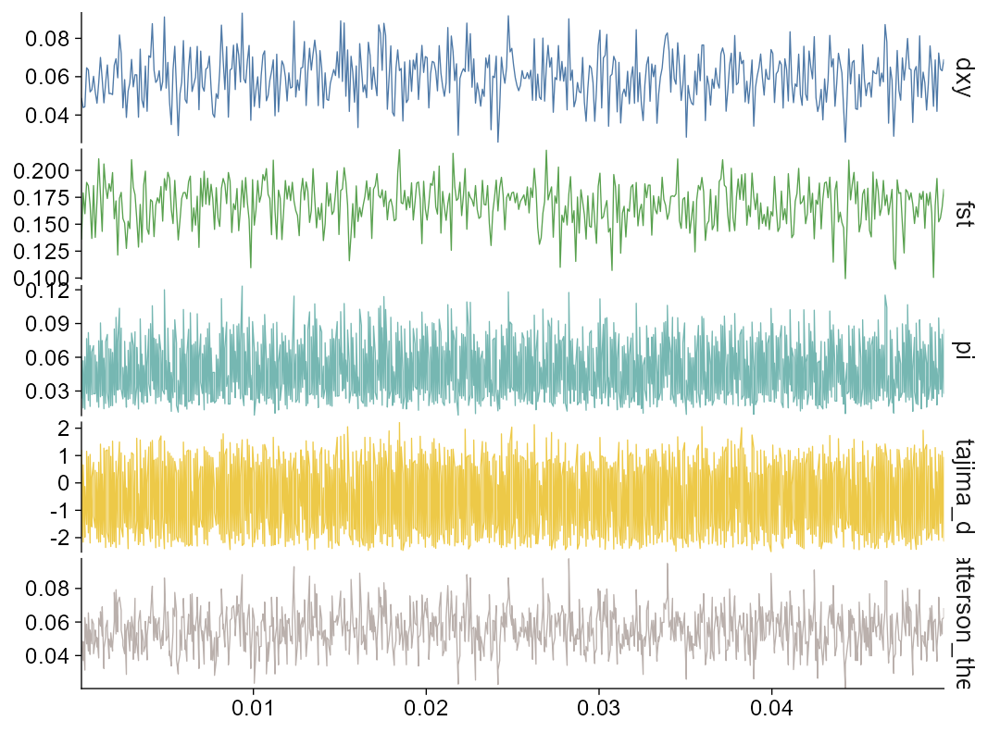

# ggpop manuscript draft: figure-driven positioning

This local manuscript draft follows the communication pattern of Engler (2025): state a practical visualization barrier, define a small and consistent grammar, show code-to-figure examples, then explain design choices and scope. The draft is intentionally conservative: `ggpop` is positioned as a final-mile visualization layer, not as a replacement for genotype-processing or statistical-analysis software.

## Working Title

**ggpop empowers population genomicists with tidy, publication-ready visualization**

Alternative titles:

- **ggpop: a tidy ggplot2 grammar for population-genomics visualization**
- **ggpop unifies publication-ready visualization for population genomics**
- **A tidy ggplot2 workflow for visualizing population-genomics results**

## Abstract

Code-based visualization is essential for reproducible population-genomics research, yet the plotting layer remains fragmented across specialized packages, command-line outputs, and laboratory-specific scripts. Modern population-genomics projects commonly use high-performance external tools for upstream computation, including PLINK and GCTA for principal component analysis, ADMIXTURE and STRUCTURE-style programs for ancestry inference, GCTA, GEMMA, and EMMAX for genome-wide association studies, and pixy or VCFtools for windowed population statistics. This division of labour is appropriate for large sequencing datasets, but it leaves researchers with inconsistent plotting interfaces for the final figures.

Here we introduce `ggpop`, an open-source R package that provides a tidy `ggplot2` extension for population-genomics visualization. `ggpop` follows a compact design principle: **import smart, return tidy objects, plot grammatically**. Heterogeneous result files are imported into typed S3 objects and visualized through two parallel interfaces: direct publication-oriented functions such as `import_gwas() |> plot_manha()` and composable grammar-style workflows such as `import_gwas() |> ggpop() + geom_manha()`. The current package supports Manhattan and Q-Q plots for GWAS results, PCA visualization with optional population metadata, admixture barplots, and aligned panels for population-genomics statistics.

`ggpop` complements, rather than replaces, analysis-oriented frameworks such as `tidypopgen`. Whereas `tidypopgen` provides a tidy grammar for manipulating and analysing biallelic SNP data with disk-backed storage and chunked operations, `ggpop` focuses on the downstream visualization of results generated by established analysis tools. For GWAS visualization, `ggpop` incorporates fastman-style plotting logic to address the speed limitations of traditional large-table Manhattan and Q-Q plotting workflows. For admixture results, it rewrites familiar pophelper-style operations as native `ggplot2` objects while preserving common concepts such as K selection, individual ordering, and population-group labels. Together, these features make `ggpop` a unified final-mile plotting layer for population genomics.

## Keywords

population genomics; data visualization; ggplot2; tidy workflow; GWAS; admixture; PCA; population statistics; R package

## Highlights

- Tidy, code-based visualization for population-genomics result files.
- Consistent `import_*() |> plot_*()` and `import_*() |> ggpop() + geom_*()` workflows.
- Typed S3 objects for GWAS, PCA, admixture, and windowed population statistics.
- Fastman-style Manhattan and Q-Q plotting for large association result tables.
- Pophelper-style admixture visualization rewritten as native `ggplot2` output.
- Built-in example workflows and publication-oriented visual defaults.

## Introduction

Data visualization is a central part of population-genomics research. It is used not only for exploratory analysis, but also for communicating principal axes of genetic variation, ancestry components, genome-wide association signals, and windowed population statistics such as FST, nucleotide diversity, Tajima's D, Dxy, and related measures. These figures frequently appear together in the same manuscript, yet they are often generated with unrelated software interfaces and inconsistent visual defaults.

At the same time, the scale of modern sequencing data has changed where computation should happen. Many population-genomics workflows no longer benefit from loading all genotype-level data into an interactive R session. Instead, upstream computation is usually performed with specialized and optimized tools: PLINK, GCTA, and flashpca-style workflows for PCA; ADMIXTURE and STRUCTURE-style programs for ancestry proportions; GCTA, GEMMA, EMMAX, and PLINK for GWAS; and pixy or VCFtools for windowed summary statistics. A visualization package should respect this practical division of labour rather than attempting to replace it.

Recent tools have brought tidy thinking to population genetics. `tidypopgen`, for example, provides a tidy grammar for manipulating and analysing biallelic SNP data and scales to large datasets through disk-backed storage and chunked computation. This addresses a different layer of the workflow from `ggpop`. `tidypopgen` focuses on genotype data structures and analysis; `ggpop` focuses on importing completed analysis results and turning them into consistent, publication-ready figures.

The missing layer is therefore not another all-purpose genotype-analysis framework, but a unified visualization grammar. A typical population-genomics paper may need a Manhattan plot, a Q-Q plot, a PCA scatter plot, an admixture barplot, and one or more regional population-statistics panels. Researchers often assemble these figures using `qqman`, pophelper, custom `ggplot2` scripts, command-line output converters, and ad hoc plotting templates. This creates repeated data-wrangling work, inconsistent palettes and themes, and plotting code that is difficult to reuse across projects.

`ggpop` addresses this final-mile problem. Inspired by the user-facing simplicity of `tidyplots`, it provides short, readable pipelines that convert common population-genomics outputs into typed tidy objects and then into `ggplot` figures. The package keeps heavy computation in established tools, while standardizing the visual layer through a small set of importers, direct plot functions, and grammar-style geoms.

## Results

### A tidy grammar for population-genomics figures

The central design of `ggpop` is a two-route plotting grammar. Each module starts with an importer that returns a typed S3 object. The same object can then be passed either to a direct plotting function or to a `ggplot2` extension workflow.

```r
import_*() |> plot_*()
import_*() |> ggpop() + geom_*()
```

The direct route is intended for users who want a publication-style figure with minimal code. The grammar route is intended for users who want the same visual result as a composable `ggplot` object. This distinction is important: the `geom_*()` functions are not alternate high-level plotting APIs. They are layer-level extensions that align with the corresponding `plot_*()` defaults wherever possible.

| Module | Importer | Direct plot | Grammar layer |
|---|---|---|---|
| GWAS | `import_gwas()` | `plot_manha()`, `plot_qq()` | `ggpop() + geom_manha()`, `ggpop() + geom_qq()` |
| PCA | `import_pca()` | `plot_pca()` | `ggpop() + geom_pca()` |
| Admixture | `import_admix()` | `plot_admix()` | `ggpop() + geom_admix()` |
| Population statistics | `import_stats()` | `plot_stats()` | `ggpop() + geom_stats()` |

This grammar keeps the public interface small while preserving access to the broader `ggplot2` ecosystem. Users can start with `plot_*()` for standard outputs and move to `ggpop() + geom_*()` when they need annotations, scale changes, themes, patchwork layouts, or journal-specific modifications.

### Figure 1. Package workflow and design principle

Suggested schematic for the paper:

1. Upstream tools produce result files.
2. `import_*()` functions create typed tidy S3 objects.
3. Users choose either direct plotting or grammar-style plotting.
4. Output is a standard `ggplot` object suitable for publication and downstream composition.

Suggested caption:

> **Figure 1. The ggpop workflow.** `ggpop` separates upstream computation from downstream visualization. Results generated by established population-genomics tools are imported as typed tidy S3 objects and visualized through either direct publication-oriented `plot_*()` functions or composable `ggplot2` extension layers using `ggpop() + geom_*()`.

This schematic should be generated later because no local overview image currently exists.

### Fast GWAS visualization

GWAS results are often stored as large tabular files, and plotting can become slow or inconsistent when users rely on general-purpose scripts. `ggpop` imports GCTA, GEMMA, and EMMAX-style association results into a common `ggpop_gwas` object and renders Manhattan and Q-Q plots using fastman-style plotting logic.

```r
import_gwas("assoc.mlma", type = "gcta") |>
  plot_manha()
```

<p align="center">
  
</p>

> **Figure 2. Publication-ready Manhattan plots from external GWAS results.** `ggpop` imports common association-result formats and renders Manhattan plots with fastman-style layout and plotting logic. The same visual defaults are available through `plot_manha()` and `ggpop() + geom_manha()`, allowing users to move from quick plotting to full `ggplot2` composition without changing the data object.

`ggpop` does not compute GWAS models. Its role is to standardize and accelerate the visualization of completed GWAS results. This scope keeps the package compatible with established association-testing tools while solving a practical bottleneck in figure generation.

### PCA visualization with population metadata

PCA remains one of the most common visual summaries of genetic structure. `ggpop` supports PCA outputs from external workflows and can join optional population metadata from a simple two-column `pop_group.txt` file. This makes it possible to apply consistent group colours and axis labels with variance explained.

```r
import_pca(
  "gcta.eigenvec",
  type = "gcta",
  eigenval = "gcta.eigenval",
  pop_group = "pop_group.txt"
) |>
  plot_pca()
```

<p align="center">
  
</p>

> **Figure 3. PCA visualization with population-group-aware colouring.** `ggpop` imports PCA coordinates and eigenvalue metadata, joins optional sample-level population labels, and produces a publication-style scatter plot with variance-explained axis labels. The corresponding `geom_pca()` layer is designed to reproduce the same default appearance inside a composable `ggplot2` workflow.

The package deliberately treats PCA computation and PCA visualization as separate steps. Users can calculate principal components with PLINK, GCTA, or flashpca-style workflows, then use `ggpop` for metadata integration, colour mapping, labels, and publication layout.

### Admixture plots as ggplot objects

Admixture barplots are visually familiar to population genomicists, but they are often produced through specialized plotting interfaces that are difficult to combine with the rest of a `ggplot2` workflow. `ggpop` implements a focused, pophelper-style interface for supported ADMIXTURE and STRUCTURE-like results while returning standard `ggplot` objects.

```r
import_admix(
  "admixture_results/",
  type = "admixture",
  ind = "samples.fam",
  pop_group = "pop_group.txt"
) |>
  plot_admix(k = 3, sort = "all", order_group = TRUE)
```

<p align="center">
  
</p>

> **Figure 4. Pophelper-style admixture visualization in the ggplot2 ecosystem.** `ggpop` preserves common admixture plotting concepts, including K selection, individual sorting, and optional population-group ordering, while returning `ggplot` objects that can be themed, combined, and exported using standard R graphics workflows.

This module should be described carefully. `ggpop` is not presented as a full reimplementation of every pophelper feature. Instead, it provides a supported subset of the familiar admixture plotting workflow in a native `ggplot2` form.

### Windowed population-genomics statistics

Population-genomics manuscripts often include regional or genome-wide summaries of differentiation and diversity. `ggpop` imports pixy and VCFtools-style outputs into a common tidy statistics object and supports chromosome or region filtering before plotting.

```r
import_stats("pixy_results/", type = "pixy") |>
  plot_stats(stat = "all", chr = "chr2L")
```

<p align="center">
  
</p>

> **Figure 5. Unified visualization of windowed population-genomics statistics.** `ggpop` imports windowed population-statistics outputs into a shared tidy object and displays selected statistics in vertically aligned panels. Users can show all supported statistics or filter by statistic, chromosome, and genomic interval.

The statistics module extends the same grammar beyond GWAS, PCA, and admixture. It is designed for a common manuscript task: showing several related genomic statistics over the same coordinate system with consistent palettes, font sizes, and themes.

## Implementation and Design Choices

### Typed S3 tidy objects

Each importer returns a typed object rather than an unstructured data frame:

- `ggpop_gwas` for association results;
- `ggpop_pca` for PCA coordinates and eigenvalue metadata;
- `ggpop_admix` for long-form ancestry proportions;
- `ggpop_stats` for windowed population statistics.

This design makes the workflow explicit and reduces repeated parsing logic in user scripts. The object class records what kind of data was imported, while the data remain accessible for downstream R operations.

### Direct functions and grammar layers

The package exposes two user-facing routes because population-genomics users have two common needs. Some users want a standard figure immediately; others want a `ggplot` object for further composition. `plot_*()` functions optimize for speed and defaults. `geom_*()` layers optimize for grammar-style composition while aligning visually with the corresponding `plot_*()` output.

### Publication defaults without black-box graphics

`ggpop` is opinionated about defaults, including palettes, point sizes, threshold-line styles, fonts, and panel layouts. However, the figures are not black boxes. They remain `ggplot` objects, so users can change scales, labels, annotations, themes, export dimensions, and multi-panel layouts using familiar R plotting tools.

### Complementarity with analysis packages

The package should be positioned as complementary to upstream tools and tidy population-genetics frameworks. It does not replace PLINK, GCTA, ADMIXTURE, GEMMA, EMMAX, pixy, VCFtools, or `tidypopgen`. Its contribution is to make their results easier to import, standardize, visualize, and publish.

## Discussion

`ggpop` addresses a practical gap in population-genomics workflows. The field already has mature tools for genotype processing, association testing, ancestry inference, and summary-statistic calculation. What remains less standardized is the final visual layer that turns heterogeneous outputs into coherent manuscript figures. By adopting tidy design principles and returning `ggplot` objects, `ggpop` lowers the cost of reproducible, code-based visualization without moving heavy computation into R.

The package is especially useful when a project combines multiple analysis outputs. A single study may use GCTA for PCA, ADMIXTURE for ancestry proportions, GEMMA for association testing, and pixy for windowed diversity statistics. Without a unified plotting layer, each output requires separate parsing, aesthetic decisions, and export logic. `ggpop` makes these steps consistent through typed importers and parallel plotting interfaces.

The design also has an educational advantage. The grammar is intentionally predictable: `import_gwas()` pairs with `plot_manha()` and `geom_manha()`, `import_pca()` pairs with `plot_pca()` and `geom_pca()`, and so on. This reduces the number of concepts users must learn before generating useful figures. At the same time, advanced users retain access to `ggplot2` customization.

## Limitations and Scope

Several boundaries should remain explicit in the manuscript:

- `ggpop` visualizes population-genomics results; it is not a full genotype-analysis framework.
- Performance claims for GWAS plotting should be supported by benchmarks before being stated quantitatively.
- The admixture module supports a focused pophelper-style workflow, not necessarily full pophelper feature parity.
- The package should avoid claiming that all upstream formats are supported unless importer tests cover them.
- Example figures demonstrate the plotting grammar, but biological interpretation depends on the input data and study design.

These limitations strengthen the paper by making the contribution precise: `ggpop` is a final-mile visualization package for population genomics.

## Chinese Positioning Summary

`tidypopgen` 已经提出了 population genetics 的 tidy grammar，但它主要解决的是 SNP genotype 数据结构、磁盘存储、分块计算、数据操作和群体遗传分析问题。`ggpop` 的定位不同：它不试图替代 `tidypopgen`，也不把所有上游计算都搬进 R。对于现代大规模测序数据，PCA、admixture、GWAS 和 window statistics 等核心计算通常更适合由 PLINK、GCTA、ADMIXTURE、GEMMA、EMMAX、pixy、VCFtools 等成熟工具完成。

目前缺少的是统一的群体基因组学可视化层。研究者经常需要在 `qqman`、pophelper、自写 `ggplot2` 脚本和不同工具输出格式之间切换，导致接口割裂、配色不统一、主题不一致、代码难复用、图形难以达到统一的发表风格。`ggpop` 的价值是补上最后一公里：把不同来源的结果导入为 typed S3 tidy objects，再通过统一的 `plot_*()` 和 `ggpop() + geom_*()` 语法生成标准 `ggplot` 图形。

可以将 `ggpop` 概括为：**面向群体基因组学结果的 tidy ggplot2 可视化扩展**。它借鉴 `tidyplots` 的用户友好思想，但服务于群体基因组学场景；它借鉴 fastman 的高效 GWAS 绘图逻辑，改善大型关联结果的 Manhattan 和 Q-Q 图绘制体验；它把常用的 pophelper admixture 绘图思想改写为 `ggplot2` 对象，使用户既保留熟悉的 K 选择、排序和分组标签，又获得 `ggplot` 图层组合能力。

## Reviewer-Risk Checklist

- **Novelty risk:** The manuscript must explain that novelty lies in unified visualization, not new statistical methods.
- **Scope risk:** Avoid implying that `ggpop` computes PCA, GWAS, or population statistics when it mainly imports and visualizes results.
- **Benchmark risk:** Do not claim faster-than-`qqman` performance quantitatively until a formal benchmark is added.
- **Compatibility risk:** Describe admixture support as pophelper-style for supported workflows, not complete pophelper replacement.
- **Reproducibility risk:** Add a code and data availability statement before journal submission.
- **Figure risk:** Generate a real Figure 1 schematic and ensure all example figures are regenerated from package code before submission.

## References to Cite

- Carter et al. (2025). `tidypopgen`: tidy population genetics in R. DOI: <https://doi.org/10.1111/2041-210x.70204>
- Engler, J. B. (2025). `tidyplots` empowers life scientists with easy code-based data visualization. DOI: <https://doi.org/10.1002/imt2.70018>
- Wickham, H. (2016). `ggplot2`: Elegant Graphics for Data Analysis.
- `fastman` GitHub repository: <https://github.com/adhikari-statgen-lab/fastman>
- `pophelper` R package and documentation for admixture visualization workflows.
